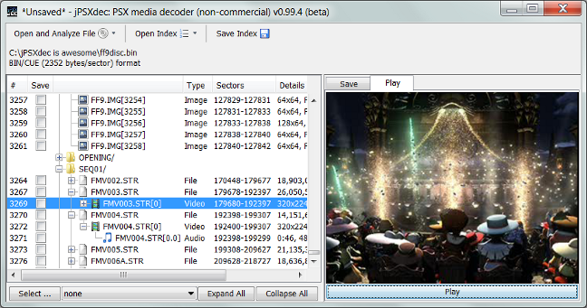

#  jPSXdec

**jPSXdec is a modern, cross-platform PlayStation 1 audio/video converter**  
Also supports extracting files and TIM images.

[ Download](https://github.com/m35/jpsxdec/releases/download/v1.00/jpsxdec_v1-00_rev3921.zip) the latest cross-platform version v1.00 (7 Sept 2019) 

See [what's new](jpsxdec/doc/CHANGES.txt).

Requires Java version 6 or higher.

Some advantages of jPSXdec over legacy tools of the past:

* Generates higher quality output
* Handles more unique movie types
* Converts with the correct colors (most legacy tools did this incorrectly)
* More accurate frame rate detection
* Cross-platform (Windows, Mac, Linux)
* Source code available 
* Usable from the command-line (for those so inclined)

jPSXdec is free for [non-commercial use](.github/LICENSE.md).

----------------------------------------------------------------------------------

### For developers and modders

* jPSXdec offers the ability to replace XA audio, video, and TIM images. Some programming skill is required (see manual for details).
* The PlayStation 1 STR video format is now well documented. View the latest version [PlayStation1_STR_format.txt](jpsxdec/PlayStation1_STR_format.txt).
* [jPSXdec design](jpsxdec/jPSXdec-design.md).
* [Tested games](jpsxdec/PSXListOFGames.txt).
